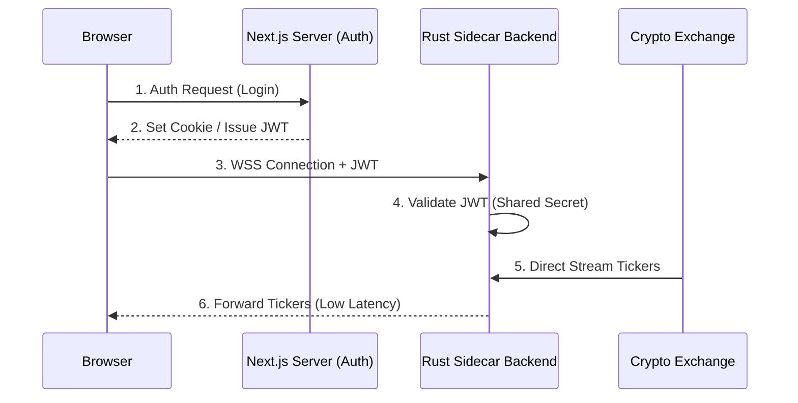

# Sidecar (Bypass) Architecture Foundation

## Overview
This document outlines the requirements and architecture for a high-performance exchange WebSocket "bypass" sidecar. The goal is to offload heavy real-time data streaming from the Next.js management layer to a lean, high-throughput Rust-based sidecar backend.

## Architecture Flow

## Implementation Phases & Cornerstone
**Cornerstone:** The **Rust Sidecar Backend** is the foundational component. It must be built first to enable the bypass capability.

### Phase 1: The Cornerstone (Rust WebSocket Server)
*Objective: Establish the high-performance pipe.*
1.  Initialize Rust project with `tokio` and `tokio-tungstenite`.
2.  Implement basic WebSocket server accepting connections.
3.  Implement JWT validation (`jsonwebtoken`) with a shared secret.
4.  **Verification**: Connect via browser console using a mock JWT; verify connection accepted/rejected.

### Phase 2: The Handshake (Gateway Integration)
*Objective: Securely route users to the sidecar.*
1.  Next.js: Generate JWTs signed with the shared secret.
2.  Next.js: Expose sidecar connection details (URL) to the frontend.
3.  **Verification**: Browser fetches token from Next.js and successfully authing against Rust sidecar.

### Phase 3: The Firehose (Exchange Integration)
*Objective: Pump data through the pipe.*
1.  Rust: Connect to external Exchange WebSockets (e.g., Binance).
2.  Rust: Parse and broadcast ticker updates to connected clients.
3.  **Verification**: End-to-end latency test (Exchange -> Rust -> Browser).

## Requirements

### [Component] Rust Sidecar Backend
- **Runtime**: `tokio` (asynchronous, event-driven runtime) [Source: tokio.rs]
- **WebSocket Protocol**: `tokio-tungstenite` for high-performance WebSocket streaming. [Source: snapview/tokio-tungstenite]
- **Authentication**: JWT validation using `jsonwebtoken` crate. [Source: keats/jsonwebtoken]
    - Must use HS256 algorithm with a shared secret from Next.js.
    - Validate `exp` (expiration) and `sub` (subject/user_id) claims.
- **Data Handling**:
    - Buffer management for ticker streams.
    - JSON serialization/deserialization via `serde` and `serde_json`.
- **Infrastructure**:
    - Configurable port for WSS.
    - TLS termination (handled by sidecar or dedicated proxy/NLB).

### [Component] Next.js Gateway (Management Layer)
- **JWT Key Sharing**: Securely share the JWT secret with the sidecar (via Env vars).
- **Client Handshake**: Provide the sidecar URL and necessary JWT for the browser to initiate the bypass connection.

### [Component] Blockchain/Exchange Connector
- **Direct Link**: Sidecar establishes high-throughput connections (WSS) to multiple exchange endpoints (e.g., Binance, OKX).
- **Parsing**: Efficient parsing of incoming ticker data before broadcasting to clients.

## Proposed Module Structure (Future Implementation)
- `apps/sidecar/`: Main Rust project.
    - `src/main.rs`: Entry point and server initialization.
    - `src/auth.rs`: JWT validation logic.
    - `src/websocket.rs`: Client connection and streaming handlers.
    - `src/exchange/`: Exchange-specific connection and parsing logic.

## Verification Plan
### Automated Tests
- Unit tests for JWT validation in Rust.
- Mock exchange stream tests using `tokio-test`.
- Load testing with `wrk` or `k6` for WebSocket throughput.

### Manual Verification
- Verify browser console connects to Rust backend directly.
- Monitor latency between exchange event and browser display.
- Ensure authentication failure correctly drops connection.
